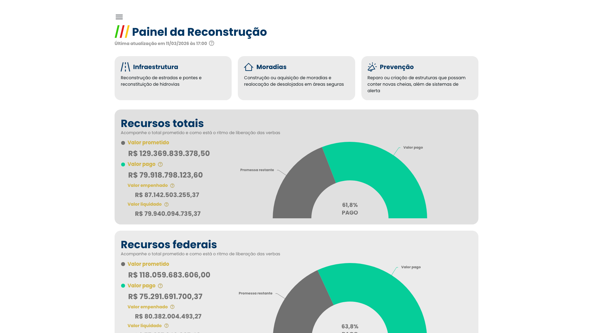
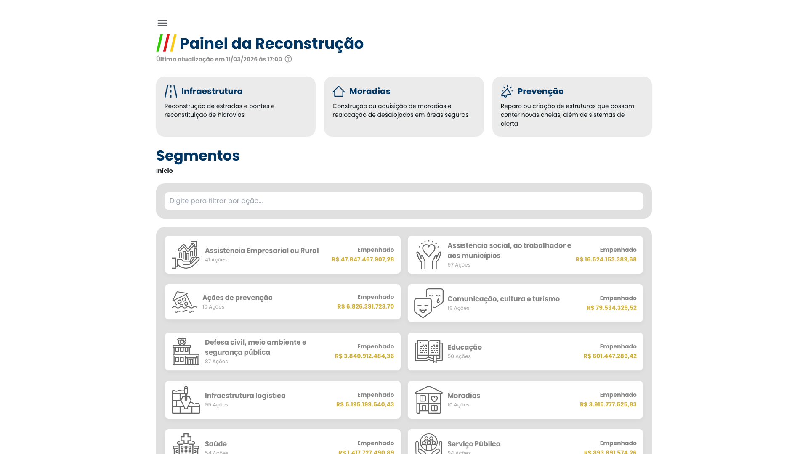
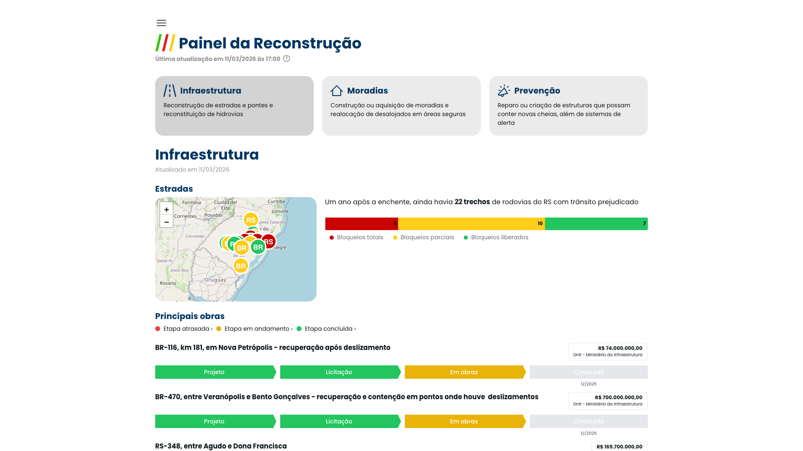
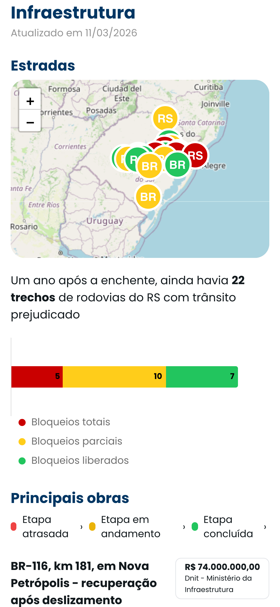
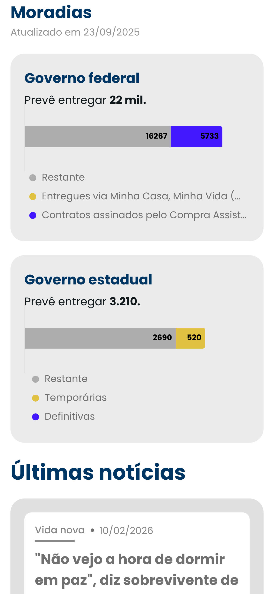
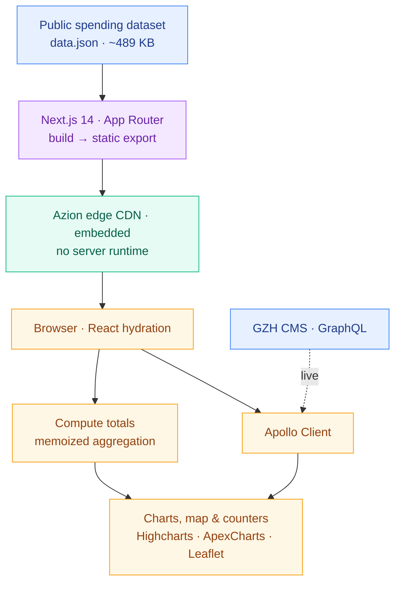

# Painel da Reconstrução

**Live public-spending dashboard tracking Rio Grande do Sul's flood recovery**

&nbsp;

[**View live →**](https://gauchazh.clicrbs.com.br/especiais/painel-da-reconstrucao/) · [On my portfolio ↗](https://kevinshibuya.com/projects/painel-da-reconstrucao) · [LinkedIn](https://linkedin.com/in/kevin-shibuya)

---

> After the catastrophic **May 2024 floods** in Rio Grande do Sul, Brazil, GZH's newsroom needed to show readers where billions in public recovery money was actually going — promised versus paid, by sector, over time. I built the interactive dashboard that tracks it: **R$129 billion** across **19 thematic sections**, published on the state's largest news platform.

## Impact

| | |
|---|---|
| 💰 **R$129.37B** | public recovery funds tracked — *promised vs. actually paid* (61.8% paid at last capture) |
| 🏆 **Prêmio RBS** | recognized with Grupo RBS's internal excellence award |
| 🗂️ **19 sections** | infrastructure, housing, hospitals, public schools, social aid, airport, productive-sector credit & more |
| 🗺️ **Statewide map** | interactive Leaflet map of road blockages across Rio Grande do Sul |
| 🛠️ **~2 years** | continuously maintained (Jun 2024 → Jun 2026), data refreshed by the newsroom |

## What it is

**Painel da Reconstrução** ("Reconstruction Panel") is a public-money transparency tool built for **GZH** (Gaúcha ZH, Grupo RBS) — the largest news outlet in Rio Grande do Sul. Readers see total, federal, and state resources at a glance, then drill into ~19 themed sections, filter spending by segment and government action, read the GZH articles tagged to each topic, and explore a live map of affected roads.

Every figure is decomposed across **Brazil's four budget-execution stages** — *anunciado* (announced) → *empenhado* (committed) → *liquidado* (settled) → *pago* (paid) — so the dashboard answers the question that matters most after a disaster: not just *what was promised*, but *what has actually been paid*.

## Screens

**Money path** — spending broken down by segment and government action, searchable:

**Infrastructure** — interactive road-blockage map, status legend, and per-project progress:

**On mobile** — overview · road map · housing delivery:

<table>
  <tr>
    <td></td>
    <td></td>
    <td></td>
  </tr>
</table>

## How it's built

**Stack:** Next.js 14 (App Router) · TypeScript · React 18 · Highcharts · ApexCharts · Leaflet · Apollo Client / GraphQL · Mantine · NextUI · Framer Motion · Tailwind CSS · SCSS Modules · Azion edge CDN.

## Engineering highlights

- **Static-export-as-embed.** The entire interactive dashboard compiles to a fully static Next.js export (`output: "export"`) served from Azion's edge CDN with **zero server runtime**, embedded into GZH's site under a sub-path. Result: edge-cacheable pages that absorb large traffic spikes without a backend.
- **Hybrid data pipeline.** A single ~489 KB `data.json` (refreshed by the newsroom) is fetched client-side and reduced through a **memoized aggregation layer** (`calculateSumarioData` / `calculateSegmentoData` / `calculateRecursosData`, cached by call site), while **Apollo Client** pulls live editorial articles per segment from GZH's GraphQL CMS.
- **Domain modeling of public budgets.** First-class modeling of the four budget-execution stages, plus an editor-tunable `DEFAULT_ESTADUAL_MANUAL_TOTAL` that lets the newsroom hand-correct the state total **without a redeploy**.
- **Right tool per visualization.** Highcharts for gauges and stacked bars (~12 sections), ApexCharts for the per-segment money-path views, and react-Leaflet for the status-coded, clustered road-blockage map.
- **Embed / standalone switch.** A `gzh-session-tmpl` URL parameter suppresses the injected parent-site header so the dashboard renders cleanly either embedded in GZH or standalone.

## My role

**Sole front-end developer.** I built the dashboard end to end — the static-export embed architecture, every data visualization, the GraphQL/CMS integration, the spending-aggregation layer, and the responsive UI across all 19 sections, maintained over ~2 years. Financial data was supplied and periodically refreshed by the GZH newsroom; visual direction followed the RBS specials design system.

---

*Painel da Reconstrução is a product of **Grupo RBS / GZH**. Its production source lives in a private company repository; this case study documents the architecture, my contribution, and the results, with screenshots captured from the live application (shown for portfolio purposes).*

**Kevin Shibuya** — Senior Front-End Engineer · React / TypeScript
[kevinshibuya.com](https://kevinshibuya.com) · [LinkedIn](https://linkedin.com/in/kevin-shibuya) · hello@kevinshibuya.com

